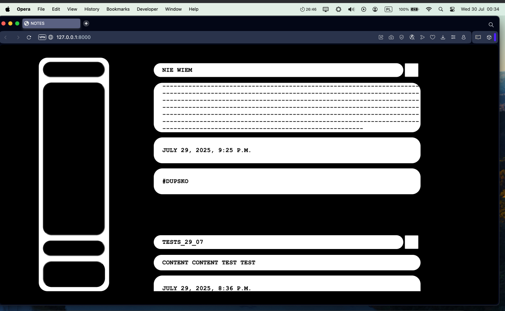

# 🗒️ NotesApp

A simple Django-based note-taking app — with tags, search. Built to stay organised without distractions.  
Uses minimalist layout using custom CSS.  
Allows to add to-do notes.

## Planned features:
- Filter notes by tags
- Delete notes marked as done

## Screenshot

Here's how the app looks for now:

29_07_25  
  
25_07_25  
