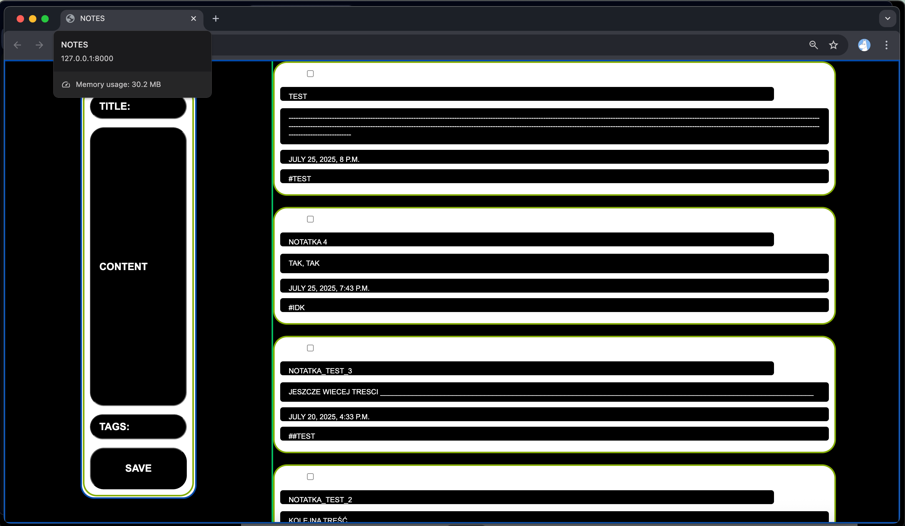

# 🗒️ NotesApp

A simple Django-based note-taking app — with tags, search. Built to stay organised without distractions.

features:

- Add and view notes
- Tag notes for filtering
- Minimalist layout using custom CSS (no frameworks)

planned features:

- User login & authentication
- Markdown editor
- Note pinning

## Screenshot

Here's how the app looks for now:

