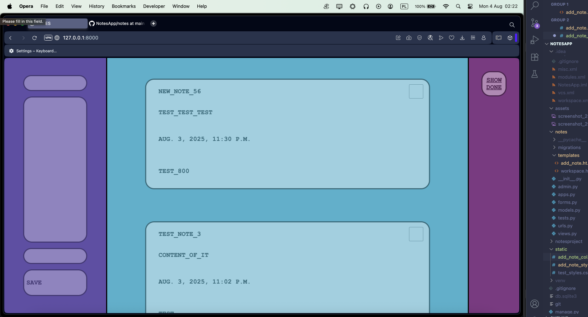
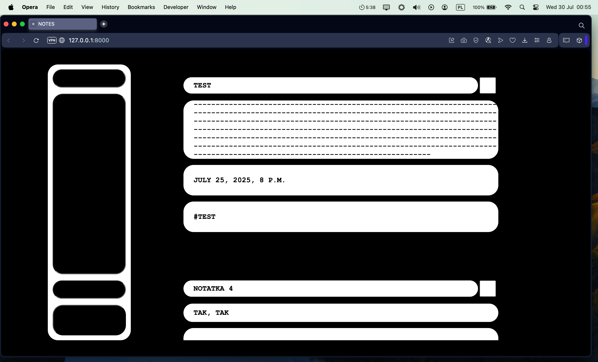
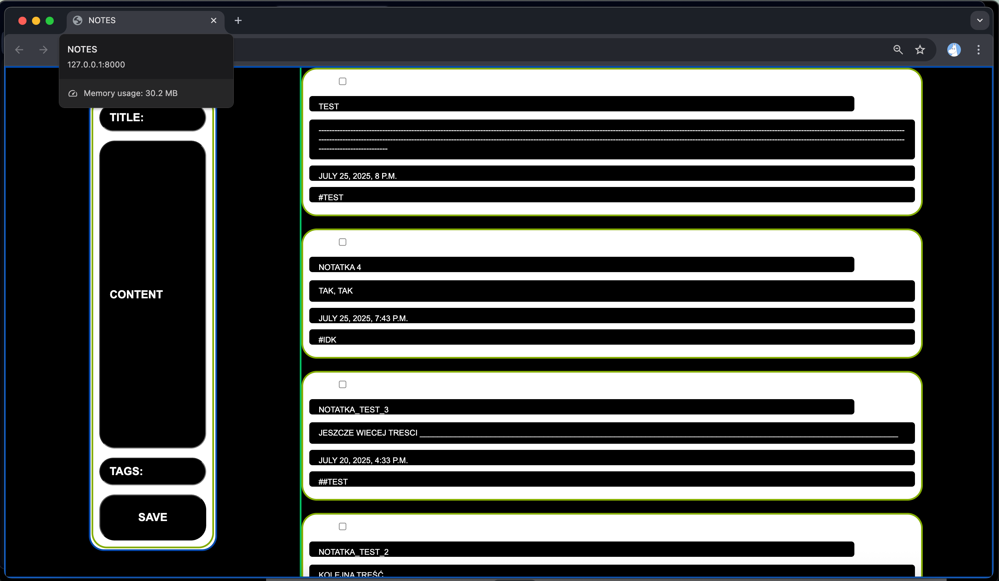

# 🗒️ NotesApp

#### https://notesapp-k6gl.onrender.com/?show_all=1&search=                      
#### _Mobile responsiveness is in progress._

A simple Django-based note-taking app — with tags, search.                   
Uses minimalist layout using custom CSS.  
Allows to add to-do notes.

## Setup:

> cd NotesApp                           
> python -m venv venv                                     
> source venv/bin/activate                            
> pip install -r requirements.txt                                   
> pip install django                           
> python manage.py makemigrations                           
> python manage.py migrate                                                         

or 

> source setup.sh

## Realised features (newest to oldest):
- Bit of a fancy look
- Deployed first public URL
- Filter notes by tags - search bar
- Toggle beetwen "To-do" and "Done" notes
- Marking notes as done/undone
- Adding notes 

## Planned features:
- Edit notes
- Add deadlines to notes
- Delete notes
- mobile-optimised version

## Built with:                                                         
- Django 5.2.5                                                                                                              
- Python 3.12                                                 
- HTML, CSS (no frameworks)                             
- Render

## Screenshots:

UI snapshots – current and previous versions

7_8_25                                                          
                             
4_8_25                             
  
29_7_25                             
  
25_7_25                             

